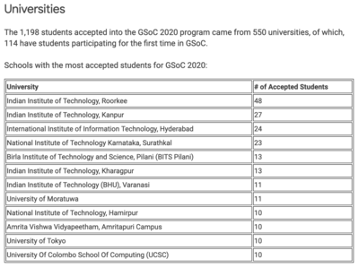

# GSoC2020がそろそろ終わります

今年の春休みごろからGoogle Summer of Code (GSoC) 2020というプログラムに参加しており、終盤に差し掛かってきたのでその体験記を書こうと思います。

Google Summer of Code というプログラムは、情報系の学生なら知っていると思うのですが、学部や学科によってはやや認知されていないところもあると思うので本記事ではGSoCとはなんなのか、またなぜ自分が参加しようと思ったのかについて書こうと思います。

具体的に自分がプログラムを通して何をしたかについては別の記事で書こうと思います。GSoCというプログラムをご存知の方は、そちらを読んでいただけたら幸いです。本記事ではテクニカルなことはほとんどないことをご了承ください。

## GSoC（ジーソック）とはなんなのか

一言で言うと、学生が3ヶ月間、OSSへコントリビューションするのをGoogleが支援するプログラムです。
OSSというのは、Open Source Softwareの略で、ソースコードが公開されており、ライセンスのもとで、コピーしたり改良したり頒布したりすることのできるソフトウェアを指します。
有名なOSSはたくさんあるのですが、例えばpythonとか、gitとかはOSSです。MATLABはOSSではありません。
コントリビューションというのは、具体的にはソフトウェアの機能の拡張だったりドキュメントの拡充だったり多岐にわたります。
プログラムの流れとしては、まずGoogleが、OSSを管理している組織をたくさん集め、それらの組織が学生にコントリビューションして欲しいタスクを複数あげます。
学生は、タスクの中から自分の取り組みたいものを選び、実装方針や計画をまとめた書類を提出します。
(ただし、組織によっては挙げられたタスク以外に自分が実装したいものがあれば、それについての計画書を提出しても良い場合があります。)
この書類が選考を通ると、5月末〜8月末(この日程は年によって多少前後することがあります)まで実装計画に基づきコーディングをしていくことになります。
コーディングの際は、OSSを管理しているプログラマにメンターとなっていただけるので、その組織の文化や、コミットの仕方など、わからないことがあれば頼ることができます。(コーディングはリモートで行います。)
自分は、Erlang Ecosystem Foundationという団体のriak core liteというソフトウェアに対してコントリビューションをさせてもらいました。
詳しくは別の記事で述べますが、Erlang Ecosystem Foundationとは、ErlangやElixirなどErlang VM上で動作する言語で書かれたOSSを育てることを目的としたコミュニティです。
GSoCに参加している組織は[こちら](https://summerofcode.withgoogle.com/organizations/)を見ていただければわかります。
今年は全部で199個の組織が参加しているそうです。見ているだけで少しワクワクしますね。組織のロゴをクリックすると今年選ばれたプロジェクトの概要がわかります。

## GSoC 統計情報

詳細な統計情報は以下に掲載されています。

[Google Summer of Code 2020 Statistics : Part1](https://opensource.googleblog.com/2020/06/google-summer-of-code-2020-statistics.html)

[Google Summer of Code 2020 Statistics : Part2](https://opensource.googleblog.com/2020/08/google-summer-of-code-2020-statistics.html)

個人的に印象的なものをピックアップすると、

- 8903個の応募があり、1199個のプロジェクトがアクセプトされたこと。

一人につき、複数のOSSに対して応募ができるので応募者数は8903より少ない6626なのですが、これは昨年より18.2%も増えているそうです。

- アクセプト数の大学ランキングで、India Institute of Technologyが凄まじいこと、University of Tokyoが同率9位にランクインしていること。

ランキングでは全体的にアジアが多いですね。アクセプトされた人のうち10%以上がIITなのはびっくりしました。インド凄まじいですね。また、おそらく今までの年で東大がランクインしていたことはなさそうなので、今年は9位で驚きました。

## 応募の動機

自分はおそらく2年前からGSoCのプログラムを知っていました。
GSoCについて初めて知ったときは、色々なOSSを見てすごいなぁと思うばかりで何をしていいかわからなかったので何もしなかったのを覚えています。
その次の年の春ごろは忙しくて応募できず、ようやく今年応募してアクセプトされました。

応募した理由は単純で、

- Erlangでのプログラミングがもっと上手くなりたかったこと
- 収入源が欲しかったこと

です。

Erlangという言語を以前アルバイトしていたところで触ったことがあり、この言語で作られたriakという、分散システム上に作られた key-value storeを使って遊んでいたことがありました。
今年はGSoC応募してみようかなと思いながら、春休みにGSoCのページを見ていたときに、Erlang Ecosystem Foundationがriak core liteというriakの兄弟のようなソフトウェアに関する募集を出していたのを見てこれはいけるのではないかと思いました。
また、大学の授業もあって、平日アルバイト・インターンをするのは厳しく感じていたので、収入源を確保するにはGSoCはもってこいだなと思ったのが応募したきっかけでした。
（言い忘れましたが、日本の大学生は例年GSoCで5500ドル前後もらえます。今年は5400ドルでした。国ごとにもらえる額が異なるので[こちら](https://developers.google.com/open-source/gsoc/help/student-stipends)を見てみてください。）
そして春休み中に応募書類を書きあげ、幸運なことにも選考に通ったという流れです。

## GSoCをやって良かったと思うこと

- 凄腕開発者と会えること

GSoCに応募する前からriakというOSSを多少触っていたのですが、その時に頻繁にパッチを投げている人や、わかりやすいチュートリアル書いている人を観測していてこの開発者たちすげえなと思っていました。GSoCでは、そのような凄腕開発者にメンターをしていただける事があります。結果、それまでネット上のどこかにいる「すげえプログラマ」と思っていた人と毎週ミーティングさせてもらえとても刺激的でした。これはGSoCなしでは実現するのは難しかったと思います。

- コミュニティへの入り口を見つけられたこと

GSoCを通してErlangのコミュニティとの心理的距離が縮まったように感じます。例えば、今年の5月ごろにはErlangコミュニティの一大イベントであるCode Beam(例年はStockholmで開催されるのですが、コロナの関係で今年はオンライン開催)のLightning Talkという小規模プロジェクトを発表するセッションで、5分程度でしたが、このGSoCで行うプロジェクトについての発表させていただきました。このようなカンファレンスに参加すること自体が初めてだった上に発表の機会をいただけたのは、自分にとってとても良い経験となりました。また、そこで行われたカンファレンスの規模や、発表の登壇者、参加者をみて、Erlangのコミュニティってこんな感じなんだとリアルに実感する事ができました。

## GSoCに応募したいと思っている人へ

GSoCは春に応募があるのですが、応募が開始される時期にはすでにOSSの機能や使われ方について多少は知っておいた方が戦略的だと思います。
というのも、応募が開始されるときにはOSSをどのように拡張するかのような一歩進んだ議論がなされるからで、そのような議論はOSSの概要を理解していないとついていけない事が多いからです。
(もちろんOSSの大きさによっては応募が開始してから準備しても大丈夫な場合はあると思いますが、そのようなOSSの場合、競争率も高いことが予想されます。)
応募したいと思っているが何をしたらいいか分からないという方は、春休み前に「OSSの名前 tutorial」などと調べて出てくるものを一通りやってみると、OSSの概要が掴めていいかもしれません。
