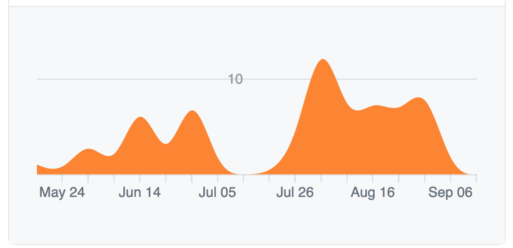

# GSoC 2020 Overview

Two weeks have passed since the final submit date of google summer of code 2020.
Now that I have taken some rest, I will write a reflection post about it.

## Overview

My journey of GSoC began in this year's March when the organizations were announced. 
Due to my university course schedules, I knew that working part-time at a company was difficult this semester so I was hoping I could work as GSoC student which allows me to work flextime.
Like any other day, I was surfing through the list of organizations, and I found that Erlang Ecosystem Foundation was participating in GSoC, and to my surprise, one of the proposals was about riak_core_lite. I instantly knew that this was the organization worth giving a shot because I had been playing around with Erlang/riak then and this project was somewhat related to what I was working on.

### `man Erlang`

Erlang is a programming language with the following features:
- Dynamically typed functional language
- Concurrent distributed programming
- Fault tolerance

### `man riak_core_lite`

riak_core is a distributed systems framework that is based on the Dynamo-Style architecture. It has served as the basis of Riak KV, a highly available masterless distributed database, providing essential features for controlling the behaviour of nodes in a database cluster. riak_core_lite is an updated version of riak_core which ensures compatibility with the recent OTP version and rebar, a build tool for erlang application and release.

## How I prepared for GSoC

The task I was applying to was to implement a Dynamo-style KV-Store using riak_core_lite. Even though I had some knowledge of riak, I needed to do a lot more research to have a detailed implementation plan in mind. I remember spending hours reading the source code of riak related projects to identify the necessary features for the project. Luckily, I was able to get in touch with the mentors at the early stage of application and got my proposal reviewed before the deadline. They highlighted and commented on ambiguous sentences in the draft so that I could fix it. A few days before the deadline, I managed to submit the proposal with a lot of help from mentors. You can access the proposal [here](https://docs.google.com/document/d/1bcWccqTCajmrPU5HZPoM3SZjT-wC77KhRICc1-8YF6E/edit?usp=sharing). 

## What I did

After waiting for one month, around May, I got notified that I got accepted to GSoC and was placed with the riak_core_lite team at Erlang Ecosystem Foundation. 

[Project Description](https://summerofcode.withgoogle.com/projects/#5484808546811904)

The first month was the community bonding period which was to know how the community works and set up the development environment. I introduced this GSoC project in the lighting talk session of CodeBEAM Virtual with the help of my mentors. They also prepared me a slack channel for asynchronous communication and almost once a week, we did a Google Hangout Meeting to keep track of the progress. 
The coding period began in June. The following image is a snnipet from my github working repo which will tell you all about my progress during the coding period. The first few weeks I was slowly starting to make progress. My progress bottomed out in mid-July because I had to study for my exams. (I told the mentors about this in advance so it was ok though.) After the exams, I dedicated most of my time implementing the features that are left and documenting on it.

 
 
The technical details of my final product is [here](https://wattlebirdaz.github.io/rclref).

## What difficulties did I face

I did not face many difficulties during this project. I think there are two reasons to this. One, the proposal I wrote was detailed enough that I can work on my own almost all the time. I did not have to ask my mentors what to do next and wait for response. Two, there were not many research questions that I needed to figure out during the implementation. The proposal was a simple coding plan which did not involve reading papers or creating algorithms to increase performance. This was good in the sense that I was able to focus more on translating the plan to code rather than creating the plan itself.

The coding plan, however, did not always went well. It was hard to stick to the schedule when I had to design a system by myself when there were no contents that I could refer to. On such occasions I had to translate a vague idea into actual code and this made me anxious whether the code is really working and whether the code is in an optimal structure. Luckily, I had set up the testing environment at an early stage of development so the former question of my anxiety could be eliminated by writing a lot of tests. However, for the latter question, I am still not sure whether my design was good or not. I feel like I need to study more on design patterns and how to write good code.

### Wrapping up

To conclude, I was able to achieve most of the goals mentioned in the proposal. Undoubtedly it was one of the most exciting semester thanks to GSoC. A big thanks to my mentors Mariano Guerra, Anette Bienisia, and Albert Schimpf for helping me through out this project!

