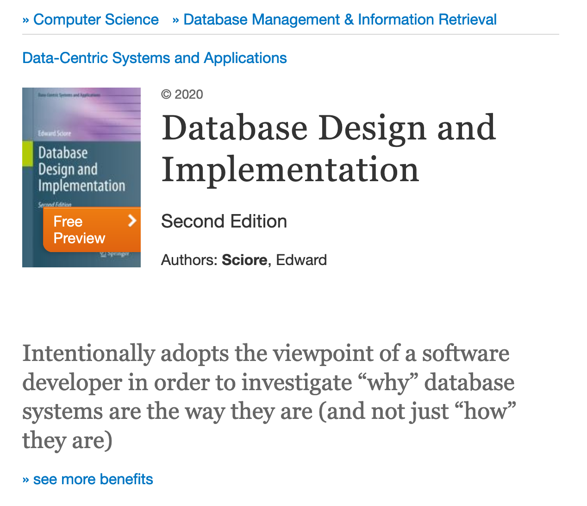
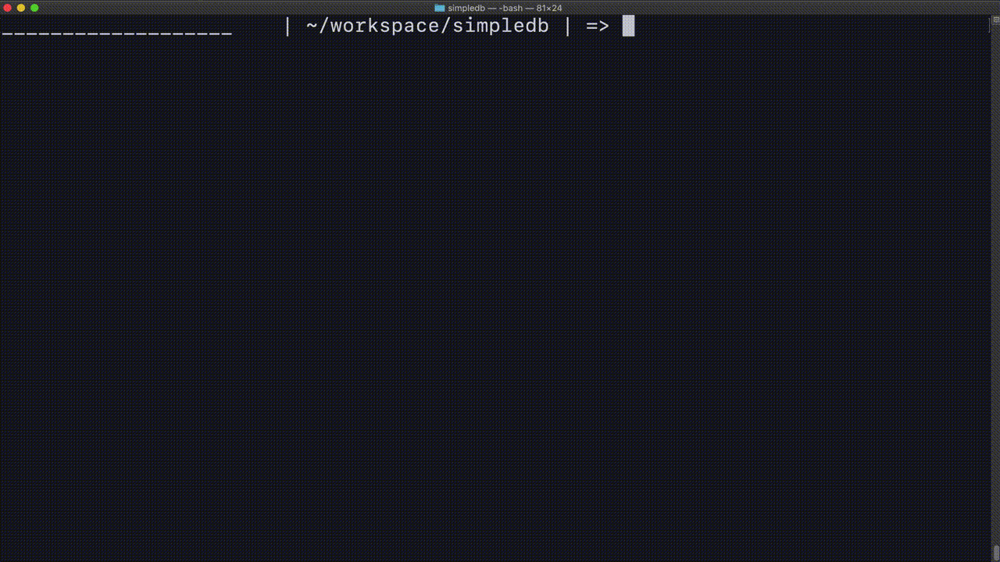

# 自作DBMSとおすすめ書籍

今年の春休みは時間があったので自作DBMSをしていました。その記録です。

## 自作DBMSの動機

去年の9月ごろまで、Google Summer of Code(GSoC) 2020で riak core liteというフレームワークを用いて分散key value storeのreference implementationをしていました。 詳しくは[こちら](https://rotaki.org/?post=20200819_gsoc1)や[こちら](https://rotaki.org/?post=20200914_gsoc2)を読んでみてください。

分散DBは、複数のデータベースノードがクラスタを組むことで可用性や耐障害性を担保しています。そのため、クラスタ内のある一つのノードが死んでいてもノード同士が適切な通信をすることで、他のノードからDBにアクセスできたり、死んでいるノードに保存されていたデータが消えないような仕組みになっています。GSoCでは主にこのノード間通信の部分の実装に取り組んでいました。通信と聞くと、レイヤーが低めなもの(ソケットプログラミングなど)を想像する人もいるかと思いますが、実際には ErlangのRemote Procedure Callを使っていたので割と高めレイヤーでの実装が多かったきがします。

しかし終わってみると、ノード間のやりとりは少しばかり理解できたものの、ノード自体の機能を全然知らないなという気分になりました。例えば、各ノードは死んだときどのような方法でリカバリーするのか、各ノードはどのような形でデータをディスクに保持しているのか、などです。レイヤー的にもデータベースのより下の方への興味が出てきていました。

その頃、セキュリティキャンプという学生向けの勉強会のDBゼミでDBMSの低いレイヤーについて詳しく勉強できるらしいということを知りました。そして応募し、参加させていただけることになりました。セキュリティキャンプDBゼミは、DBMSを自作して講師の方(星野さん)にコードレビューをしていただく、という流れで行われました。期間は10月末から12月の頭まででした。そこでガッツリDBMSを学んでやるぞという気分でいたのですが、11月ごろから大学の課題が大量に降ってきたため、DBMSの開発が思うように進まなくなってしまいました。こりゃいけないと思い、コードを書く時間を増やそうとしたのですが、DBMSやC++への理解が浅く何度も作っては壊しを繰り返して、結果セキュリティキャンプは不完全燃焼気味に終わりました。

そして最近ようやく大学の秋セメスターが終了して春休みに突入したので、またDBMSを実装するかと思って作りました。

## SimpleDB

セキュリティキャンプでは星野さんが作成してくださったDBMSの諸所の概念を説明した入門書を読みながら自作していたのですが、それだけで実装に落とし込むのは自分には難しいと感じられたため、いろいろネットを漁って自作OS本(緑)のように解説に実装が並列してあるような本は無いか探しました。すると、[Hacker News](https://news.ycombinator.com/item?id=21793270)で[Database Design and Implementation](https://www.springer.com/gp/book/9783030338350)という本をお勧めしている人がいたので買ってみました。その本はJavaで作った教育用のDBMSであるSimpleDBを解説した本でした。内容はデータのファイルへの書き込みから、Btree-Index、Query Optimizationまで幅広く解説し実装を示しているので、手を動かしたい自分みたいな人には良いと思いました。SimpleDBのプロジェクトページは[こちら](http://www.cs.bc.edu/~sciore/simpledb/)になります。そこから最終的に出来上がるSimpleDBをダウンロードできます。

 

自分はJavaがわからないのでSimpleDBをC++で実装し直すことにしました。
そして作ったものが[こちら](https://github.com/wattlebirdaz/simpledb)になります。2021の2月の第2週から初めておおよそ1ヶ月ちょっとかかりました。
Javaのsynchornizedをmutex/recursive mutexを利用して実装したり, newを make_shared や make_uniqueに置き換えたりして実装していきました。他にもJavaのライブラリにあってC++のライブラリにないものを自分で書いたり、ビルドツール群やgoogle testを整備するなど工夫をする必要がありました。
まだ実装を直したいと思うところはいくつかあるのですが、とりあえず本に書いてある主要な概念はほぼ全て実装し、いくつかのテストは通っているので良いとします。気が向いたらやろうと思います。

この本は結構おすすめです。本の各章に理論、実装それぞれの演習問題がついており、理論的なことを学ぶのにも役立ちますし、DBMSを拡張する指針にもなります。また各章に文献もついているので次に何を読めば良いかわかるのも嬉しいです。

## まとめ

ソフトウェアのインフラの凄さを改めて実感しました。自作したDBMSなんて怖くて使えません。Postgresは偉大です。
